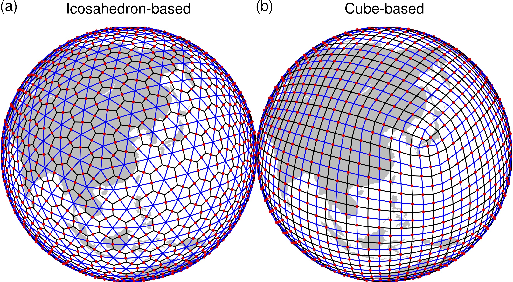
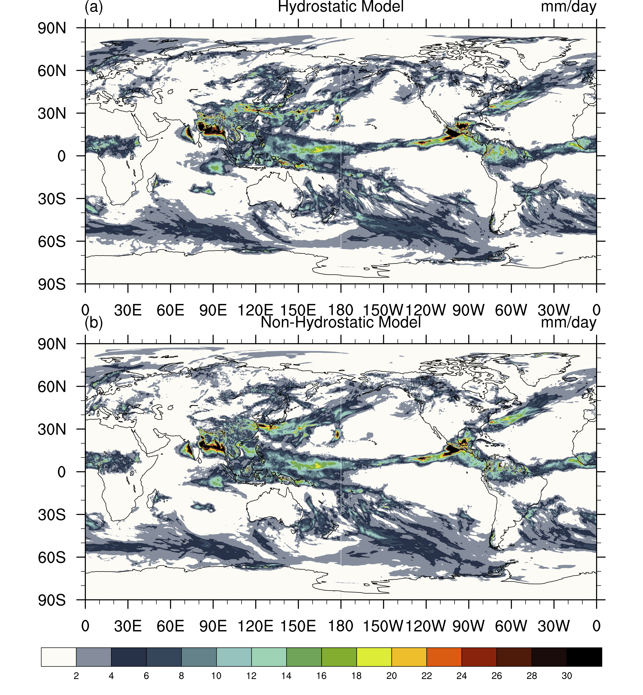
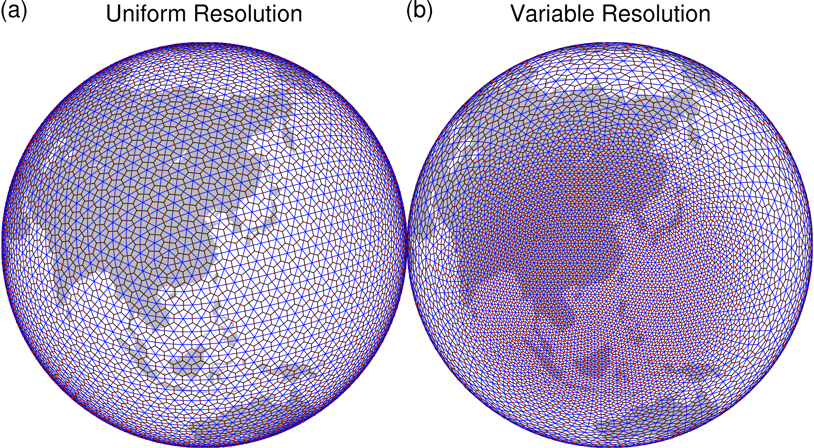
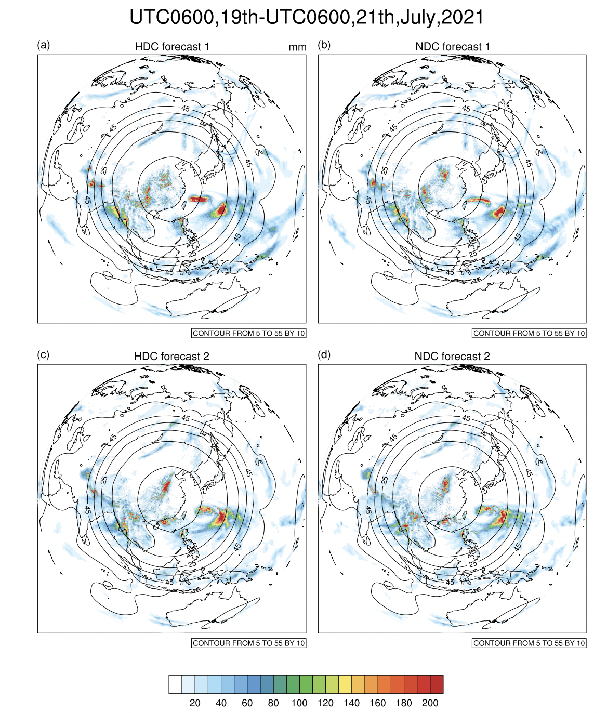
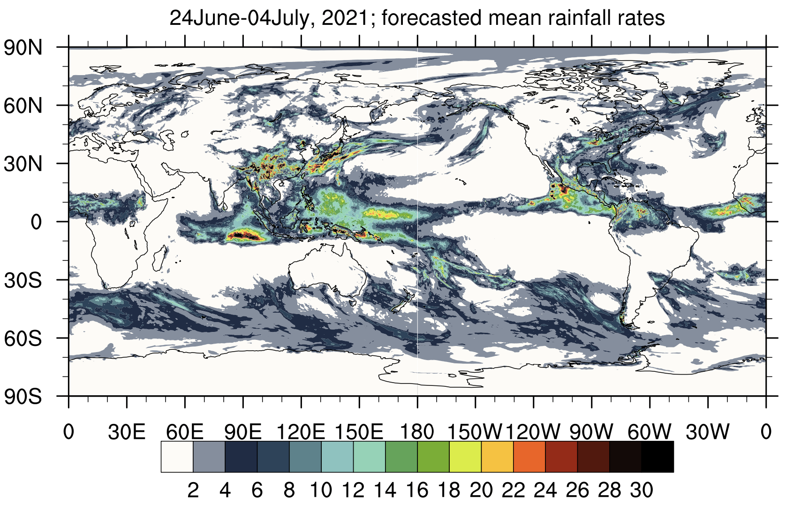
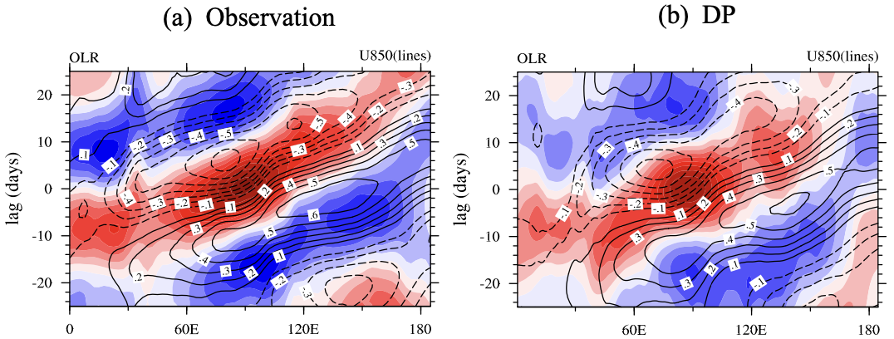

## About
GRIST (Global-to-Regional Integrated forecast SysTem) is a unified model system for global weather and climate modeling. It is currently being jointly developed by model developers at Chinese Academy of Meteorological Sciences, PIESAT Information Technology Co Ltd, Tsinghua University, CMA Earth System Modeling and Prediction center,... etc.  

GRIST is developed to explore the possibility of unification in response to a broad need &/ voice for unified weather and climate modeling. In practice, because global weather and climate modeling differ significantly in terms of their spatial and temporal scales, the so-called unification is pursued following two routes: (i) to maximize the possibility of constructing weather and climate models using a single model framework and dynamical core; (ii) to maximize the possibility of using a unified model formulation with minimum application-specific changes for weather-to-climate forecast applications that are relevant to most operational business demands.

## Overview
### Multi-purpose global modeling
The multi-purpose modeling capabilities of GRIST are organized in terms of "working mode".  

GRIST has 2 major working modes for global three-dimensional atmosphere modeling and forecast:  
GRIST-AMIPW: this setup couples GRIST with a high-resolution (down to km-scale) oriented physics suite for weather-to-climate forecast applications.  
GRIST-AMIPC: this setup couples GRIST with a comprehensive, long-term climate-modeling oriented physics suite for multi-centries applications.  
#### AMIPW
1. Zhang, Y., R. Yu, J. Li, X. Li, X. Rong, X. Peng, and Y. Zhou, (2021), AMIP Simulations of a Global Model for Unified Weather-Climate Forecast: Understanding Precipitation Characteristics and Sensitivity Over East Asia. Journal of Advances in Modeling Earth Systems, 13(11), e2021MS002592.doi:https://doi.org/10.1029/2021MS002592.   
2. Zhou, Y., Y. Zhang, J. Li, R. Yu, and Z. Liu, (2020), Configuration and evaluation of a global unstructured mesh atmospheric model (GRIST-A20.9) based on the variable-resolution approach. Geosci. Model Dev., 13(12), 6325-6348.doi:10.5194/gmd-13-6325-2020.   
3. Zhang, Y., X. Li, Z. Liu, X. Rong, J. Li, Y. Zhou, and S. Chen, (2022), Resolution Sensitivity of the GRIST Nonhydrostatic Model from 120 to 5 km (3.75 km) during the DYAMOND winter. Earth and Space Science.  
...
#### AMIPC
1. Li, X., Y. Zhang, X. Peng, W. Chu, Y. Lin, and J. Li, (2022), Improved Climate Simulation by Using a Double-Plume Convection Scheme in a Global Model. Journal of Geophysical Research: Atmospheres, 127(11), e2021JD036069.doi:https://doi.org/10.1029/2021JD036069.   
2. ...

GRIST has 3 minor working modes, i.e., Shallow Water Model, Single-Column Model, DTP (Dycore-Tracer-Physics) model for isolated testing of individual component.  
#### Dycore-Tracer-Physics (DTP) model
1. Zhang, Y., J. Li, R. Yu, S. Zhang, Z. Liu, J. Huang, and Y. Zhou, (2019), A Layer-Averaged Nonhydrostatic Dynamical Framework on an Unstructured Mesh for Global and Regional Atmospheric Modeling: Model Description, Baseline Evaluation, and Sensitivity Exploration. Journal of Advances in Modeling Earth Systems, 11(6), 1685-1714.doi:10.1029/2018MS001539.  
2. Zhang, Y., J. Li, R. Yu, Z. Liu, Y. Zhou, X. Li, and X. Huang, (2020), A Multiscale Dynamical Model in a Dry-Mass Coordinate for Weather and Climate Modeling: Moist Dynamics and Its Coupling to Physics. Monthly Weather Review, 148(7), 2671-2699.doi:10.1175/MWR-D-19-0305.1.  
3. Li, J., and Y. Zhang, (2022), Enhancing the stability of a global model by using an adaptively implicit vertical moist transport scheme. Meteorology and Atmospheric Physics, 134(3), 55.doi:10.1007/s00703-022-00895-5.  
#### Shallow Water Model (SWM)
1. Wang, L., Y. Zhang, J. Li, Z. Liu, and Y. Zhou, (2019), Understanding the Performance of an Unstructured-Mesh Global Shallow Water Model on Kinetic Energy Spectra and Nonlinear Vorticity Dynamics. Journal of Meteorological Research, 33(6), 1075-1097.doi:10.1007/s13351-019-9004-2.  
2. Zhang, Y., (2018), Extending High-Order Flux Operators on Spherical Icosahedral Grids and Their Applications in the Framework of a Shallow Water Model. Journal of Advances in Modeling Earth Systems, 10(1), 145-164.doi:10.1002/2017MS001088.  
#### Single-Column Model (SCM)
1. Li, X., Zhang, Y., Peng, X., and Li, J.: Using a single column model (SGRIST1.0) for connecting model physics and dynamics in the Global-to-Regional Integrated forecast SysTem (GRIST-A20.8), Geosci. Model Dev. Discuss., 2020, 1-28, 10.5194/gmd-2020-254, 2020.  
2. ...
#### Computing Infrastructure
1. Liu, Z., Zhang, Y., Huang, X., Li, J., Wang, D., Wang, M., and Huang, X.: Development and performance optimization of a parallel computing infrastructure for an unstructured-mesh modelling framework, Geosci. Model Dev. Discuss., 2020, 1-32, 10.5194/gmd-2020-158, 2020.  
2. Wang, T., L. Zhuang, J. M. Kunkel, S. Xiao, and C. Zhao, 2020: Parallelization and I/O Performance Optimization of a Global Nonhydrostatic Dynamical Core Using MPI. Computers, Materials & Continua, 63.  
3. ...

### Unstructured grid

  
  Standardized element and connectivity for grid flexibility   

### Switchable hydrostatic and nonhydrostatic modeling 

  
  With proper configurations, the hydrostatic and nonhydrostatic models of GRIST generate very consistent solutions for relatively coarse grid spacing   

### Global multi-resolution forecast 

  
  Uniform- and Variable-Resolution meshes

  
   7.20 torrential rainfall event, Henan province, China. Forecasts produced by GRIST (HDC: hydrostatic; NDC: nonhydrostaic)   
   The unstructured grid allows GRIST to be configured as a multi-resolution global model, so as to support regional km-scale forecast within a global model.   

## Applications
### GRIST for DYAMOND global storm-resolving simulations
https://easy.gems.dkrz.de/DYAMOND/Winter/index.html  

  
  Fig. 2 Experimental global storm-resolving simulations by GRIST Nonhydrostatic Model during the DYAMOND winter. Visualization by Florian Ziemen/ESiWACE2/DKRZ  

### GRIST for medium-range global weather forecast 

  

  Fig. 3 Prototype global 0.125-degree/L60 medium-range NWP configuration of GRIST.  

### GRIST for conventional global climate modeling 

  

  Fig. 4 Cross-lag correlation of outgoing longwave radiation during the boreal winter to reflect MJO's propagation. Conventional global climate simulations at 1-degree.  

## TermsAndConditions
The model code can be accessed by anyone who has interest. As a simple registration procedure, please just send a username (github) to grist_dev@163.com so as to activate access authority if wanted.  
